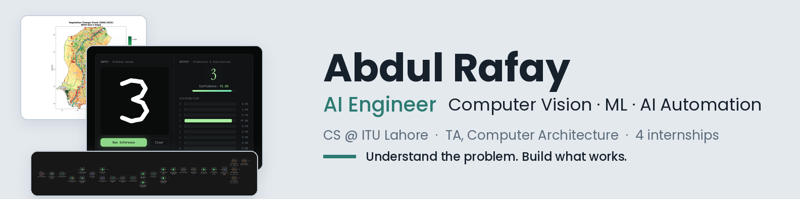
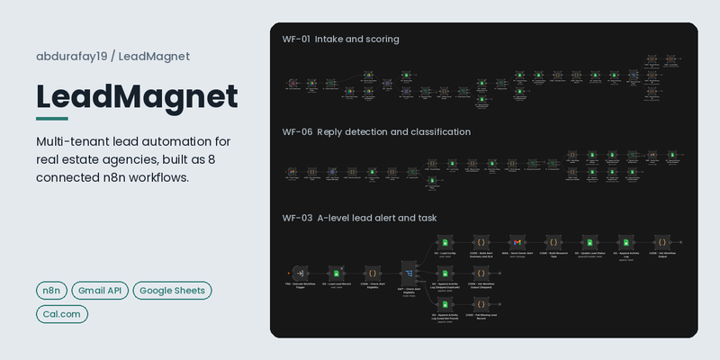
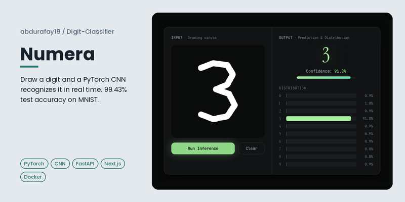
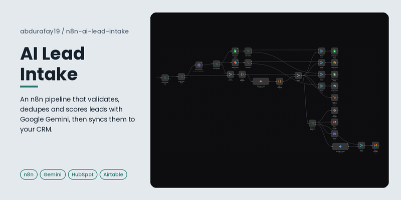
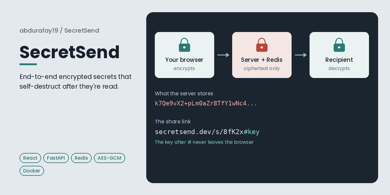
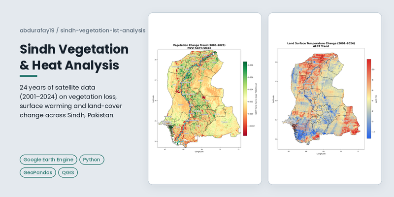
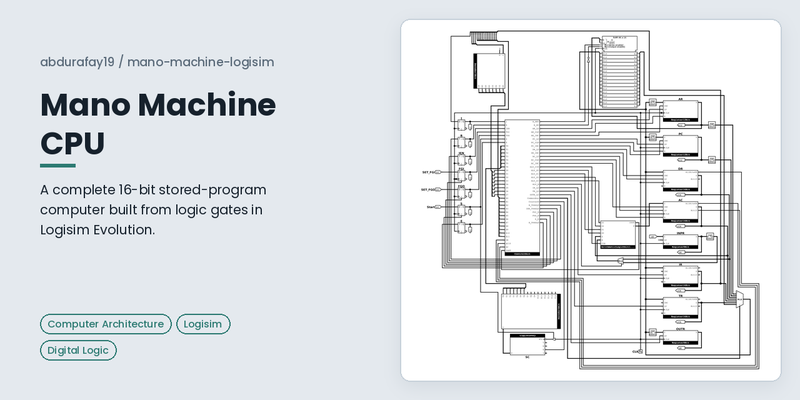

  <picture>
    <source media="(prefers-color-scheme: dark)" srcset="./banner-dark.png">
    <source media="(prefers-color-scheme: light)" srcset="./banner.png">
    
  </picture>

<h1 align="center">Hi, I'm Abdul Rafay 👋</h1>

  <picture>
    <source media="(prefers-color-scheme: dark)" srcset="https://readme-typing-svg.demolab.com?font=Fira+Code&weight=500&size=20&duration=4000&pause=1800&color=4FC4B0&center=true&vCenter=true&width=640&height=40&lines=Computer%20vision%20pipelines%20with%20YOLO%20and%20OpenCV;PyTorch%20models%20served%20in%20production;n8n%20AI%20automations%20that%20run%20themselves">
    <source media="(prefers-color-scheme: light)" srcset="https://readme-typing-svg.demolab.com?font=Fira+Code&weight=500&size=20&duration=4000&pause=1800&color=2C7A72&center=true&vCenter=true&width=640&height=40&lines=Computer%20vision%20pipelines%20with%20YOLO%20and%20OpenCV;PyTorch%20models%20served%20in%20production;n8n%20AI%20automations%20that%20run%20themselves">
    
  </picture>

  <b>AI Engineer · Computer Vision · Machine Learning · AI Automation</b> 
  CS student at ITU Lahore and Teaching Assistant for Computer Architecture

  I build computer vision pipelines, trained ML models and AI automations that work in production.
  My background in algorithms, systems programming and computer architecture lets me go below
  the libraries when off-the-shelf tools fall short.

  
  
  

---

## 🧠 What I work on

<table>
<tr>
<td width="33%" valign="top">

### 👁️ Computer Vision & ML
- Object detection and tracking (YOLO, OpenCV)
- Custom CNNs trained in PyTorch
- Real-time pipelines in Python and C++
- Model serving with FastAPI and Docker

</td>
<td width="33%" valign="top">

### ⚙️ AI Automation
- Multi-workflow systems in n8n
- LLM scoring, classification and replies
- CRM, Gmail, Sheets and Slack integrations
- Error handling, logging and config-driven design

</td>
<td width="33%" valign="top">

### 🛠️ Systems & Backend
- REST APIs with FastAPI and PostgreSQL
- End-to-end encrypted web apps
- Satellite data analysis (Google Earth Engine)
- CPU design and low-level systems in C

</td>
</tr>
</table>

---

## 🔥 Featured projects

<table>
<tr>
<td width="50%" valign="top">

**[LeadMagnet](https://github.com/abdurafay19/LeadMagnet)** 
Multi-tenant real estate lead system of 8 connected n8n workflows: lead scoring, follow-ups, Cal.com booking sync, AI reply classification and daily reports, with each agency's data kept separate. 
`n8n` `Gmail API` `Google Sheets` `Cal.com`
</td>
<td width="50%" valign="top">

**[Numera](https://github.com/abdurafay19/Digit-Classifier)** · [Live demo](https://huggingface.co/spaces/abdurafay19/Digit-Classifier) 
Draw a digit and a CNN I trained from scratch recognizes it in real time. 99.43% test accuracy on MNIST with about 161K parameters. 
`PyTorch` `FastAPI` `Next.js` `Docker`
</td>
</tr>
<tr>
<td width="50%" valign="top">

**[AI Lead Intake](https://github.com/abdurafay19/n8n-ai-lead-intake)** 
Validates, deduplicates and ranks form leads with Google Gemini, then syncs them to HubSpot, Airtable and Sheets, alerts the team and sends a guarded AI reply. 
`n8n` `Gemini` `HubSpot` `Airtable`
</td>
<td width="50%" valign="top">

**[SecretSend](https://github.com/abdurafay19/SecretSend)** · [Live](https://secretsend.dev) 
Share secrets through links that self-destruct after reading. AES-GCM encryption runs in the browser, so the server only ever stores ciphertext. 
`React` `FastAPI` `Redis` `Web Crypto`
</td>
</tr>
<tr>
<td width="50%" valign="top">

**[Sindh Vegetation & Heat Analysis](https://github.com/abdurafay19/sindh-vegetation-lst-analysis)** 
24 years of Landsat and MODIS data on vegetation loss, surface warming and land-cover change across Sindh, Pakistan. 
`Google Earth Engine` `Python` `GeoPandas` `Remote Sensing`
</td>
<td width="50%" valign="top">

**[Mano Machine CPU](https://github.com/abdurafay19/mano-machine-logisim)** 
A complete 16-bit stored-program computer built from logic gates: 35 custom subcircuits, a hardwired control unit and all 25 instructions. 
`Computer Architecture` `Digital Logic` `Logisim`
</td>
</tr>
</table>

**Group project:** [Distributed Shared Memory (DSM)](https://github.com/ZERO-70/DSM), a DSM library in C for nodes on a local network, with demand paging, page-fault handling and synchronization.
`C` `Distributed Systems` `Operating Systems`

---

## 💼 Experience

<b>Roles and internships</b>

 

| Role | Where | When |
|---|---|---|
| Teaching Assistant, Computer Architecture | Information Technology University | Aug 2026 – Present |
| AI Automation & Software Development Intern | Magnetar Solutions | Jun – Aug 2026 |
| Teaching Assistant, Algorithms | Information Technology University | Jan – Jul 2026 |
| Machine Learning Intern | Qult Technologies | Dec 2025 – Mar 2026 |
| Industrial Automation Intern | Automate International | Jul – Aug 2025 |
| Computer Vision Intern | AIBee.pk | Mar – Sep 2025 |
| Teaching Assistant, Discrete Mathematics | Information Technology University | Aug – Dec 2024 |

---

## 🧰 Tech stack

<b>Tools I use</b>

 

**AI & ML** 
<picture>
  <source media="(prefers-color-scheme: dark)" srcset="https://skillicons.dev/icons?i=pytorch,opencv&theme=dark">
  <source media="(prefers-color-scheme: light)" srcset="https://skillicons.dev/icons?i=pytorch,opencv&theme=light">
  
</picture> 

**Automation** 

**Languages & backend** 
<picture>
  <source media="(prefers-color-scheme: dark)" srcset="https://skillicons.dev/icons?i=python,cpp,c,js,fastapi,nextjs,react,postgres,redis&theme=dark">
  <source media="(prefers-color-scheme: light)" srcset="https://skillicons.dev/icons?i=python,cpp,c,js,fastapi,nextjs,react,postgres,redis&theme=light">
  
</picture>

**Deployment & tools** 
<picture>
  <source media="(prefers-color-scheme: dark)" srcset="https://skillicons.dev/icons?i=docker,vercel,nginx,linux,git&theme=dark">
  <source media="(prefers-color-scheme: light)" srcset="https://skillicons.dev/icons?i=docker,vercel,nginx,linux,git&theme=light">
  
</picture> 

---

## 🌱 Currently

- 🌾 Exploring computer vision for crop disease detection (Meri Fasal R&D)
- 🎓 Teaching Assistant for Computer Architecture at ITU
- 🔍 Open to AI engineering roles, internships and freelance projects

---

  <picture>
    <source media="(prefers-color-scheme: dark)" srcset="https://raw.githubusercontent.com/abdurafay19/abdurafay19/output/github-contribution-grid-snake-dark.svg">
    <source media="(prefers-color-scheme: light)" srcset="https://raw.githubusercontent.com/abdurafay19/abdurafay19/output/github-contribution-grid-snake.svg">
    
  </picture>

  <i>Understand the problem. Build what works.</i>

